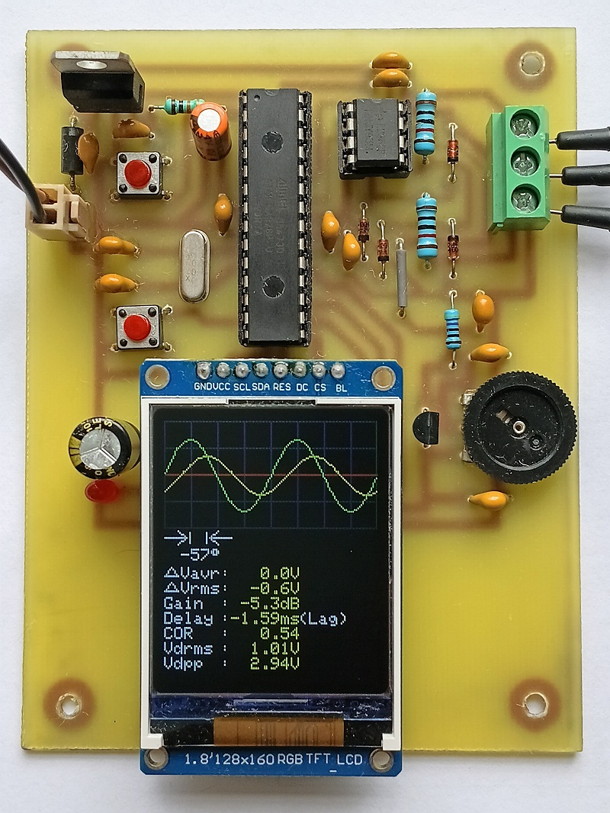
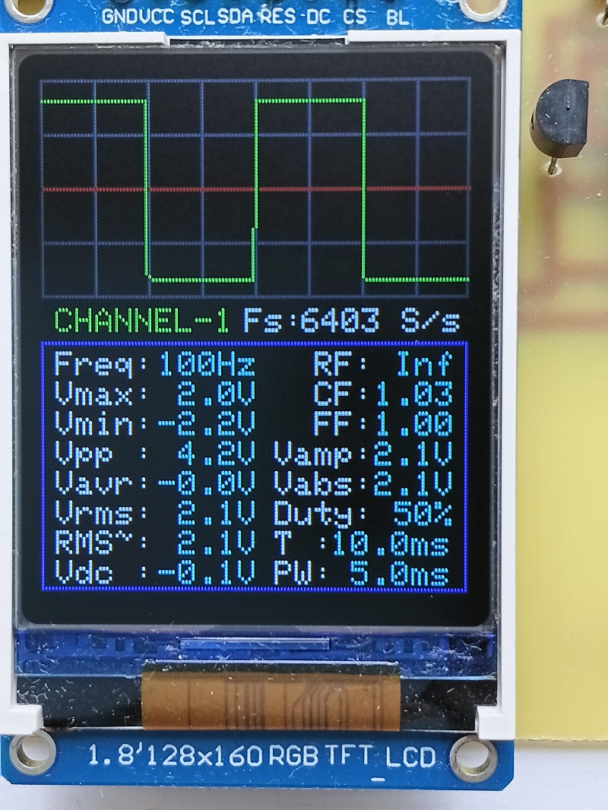
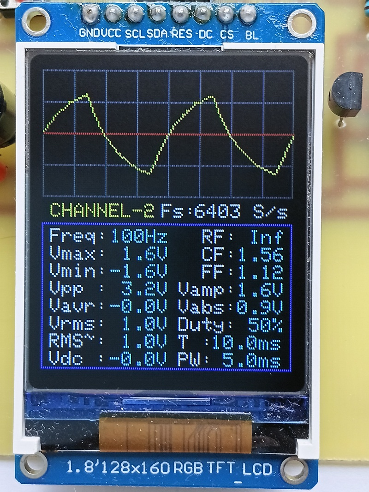
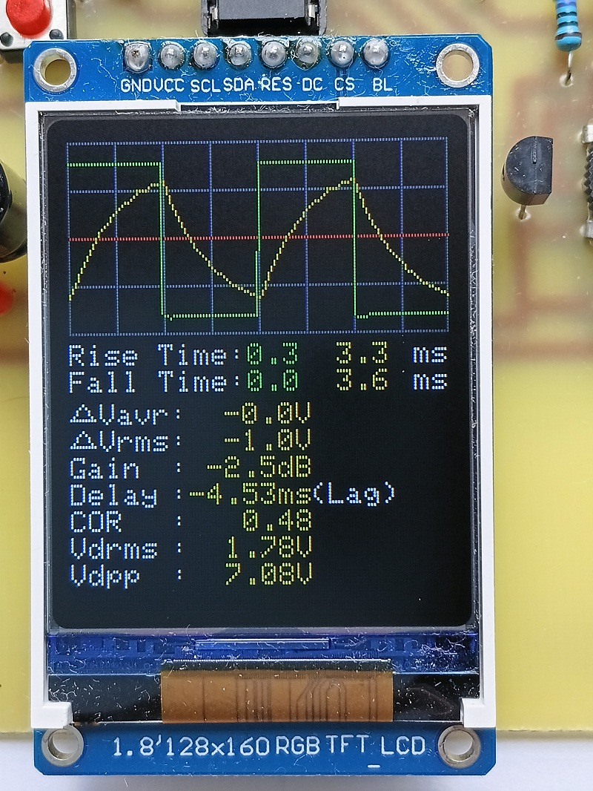
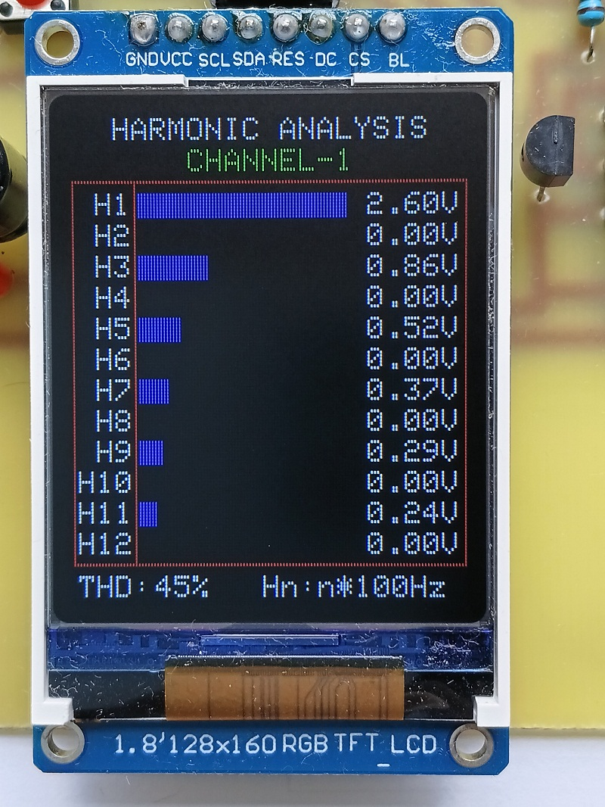
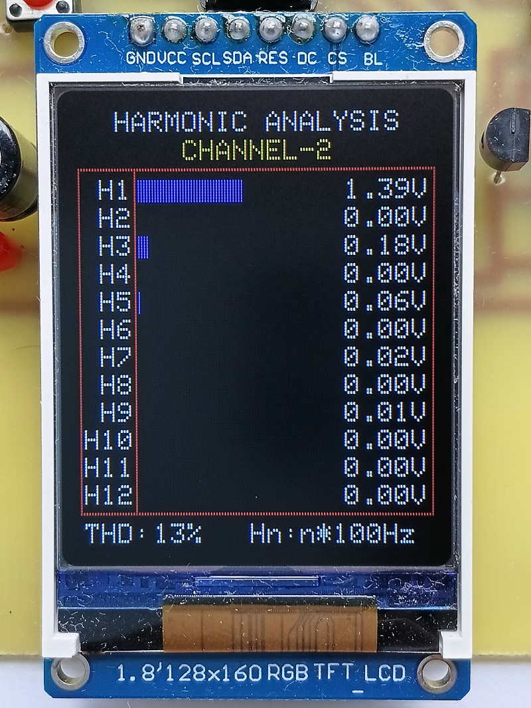
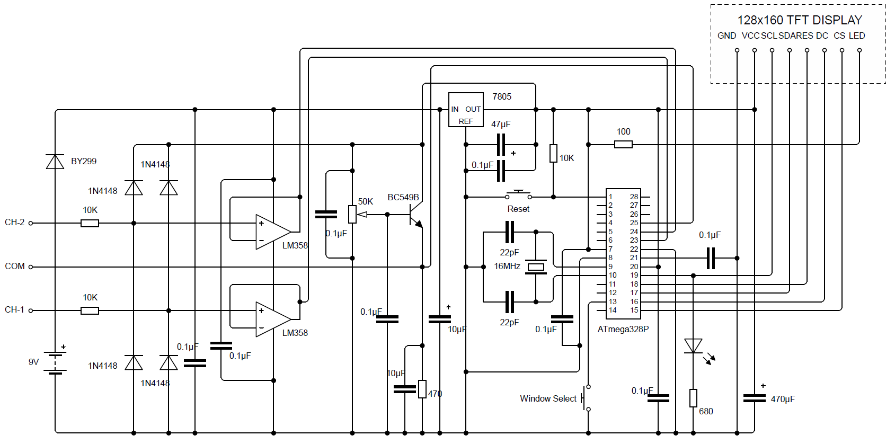

# Intelligent Dual-Channel Oscilloscope & Waveform Analyzer

An ATmega328P-based standalone dual-channel oscilloscope and waveform analyzer with automatic acquisition adjustment and extensive real-time waveform measurements.

## Overview

This project is a low-cost, custom-built digital oscilloscope based on the **ATmega328P** microcontroller and a **128×160 TFT display**.

Unlike a simple Arduino waveform display, the instrument automatically analyses the acquired signals and presents a large amount of useful information. It provides two-channel waveform visualization, automatic acquisition adjustment, voltage and timing measurements, phase comparison, gain and delay measurement, THD calculation, and harmonic analysis.

The project was first developed and tested using an Arduino Uno platform and was subsequently implemented on a **custom single-sided PCB**. The custom PCB produced noticeably smoother waveform display, reduced visible jitter, and improved high-frequency performance.



## Main Features

- ATmega328P-based embedded oscilloscope
- Dual analog input channels
- 128×160 colour TFT display (Driver ST7735)
- Automatic acquisition/sampling adjustment according to signal frequency
- Sampling rate (Fs)
- Real-time waveform display
- Frequency measurement
- Vmax and Vmin
- Vpp
- Average voltage (Vavg)
- RMS voltage (Vrms)
- RMS of AC component (RMS~)
- DC offset voltage (Vdc)
- Amplitude (Vamp)
- Average absolute voltage (Vabs)
- Duty cycle
- Pulse width
- Ripple factor (RF)
- Crest factor (CF)
- Form factor (FF)
- Rise time and fall time
- Total Harmonic Distortion (THD)
- Harmonic spectrum analysis
- Phase difference between two channels
- ΔVavg between channels
- ΔVrms between channels
- Gain in dB
- Time delay between channels
- Correlation coefficient (COR)
- Differential RMS voltage (Vdrms)
- Differential peak-to-peak voltage (Vdpp)
- Visual indication of the relative peak displacement between CH1 and CH2
- Automatic measurement frequency range of approximately 5 Hz to 2.5 kHz
- General waveform and measurement functions remain practically useful to approximately 2.5 kHz and beyond; display becomes increasingly congested at higher frequencies
- Highly accurate phase measurement across the operating range and beyond
- Harmonic-spectrum and THD measurements are particularly accurate up to approximately 500 Hz

## Automatic Operation — No Measurement Setup Required

A key design goal of this project is **simplicity through comprehensive automatic analysis**.

Conventional oscilloscopes provide a very wide range of measurement and configuration options, but effective operation generally requires the user to understand the instrument's controls and manually select or configure the measurements required for a particular task.

This project follows a different philosophy:

> **Connect the signal → automatically acquire it → automatically adjust the acquisition → automatically analyse it → present the useful measurements.**

The instrument continuously calculates a comprehensive set of waveform and electrical parameters without requiring the user to individually select each measurement. More than **40 parameters** are available across the display windows, covering voltage, timing, waveform shape, two-channel comparison, phase, gain, delay, correlation, differential measurements, THD, and harmonic information.

This makes the instrument particularly suitable for **students, beginners, educational laboratories, and workshop applications**, while still providing useful information to experienced users.

The objective is not to eliminate the advanced capabilities of a conventional oscilloscope, but to make a broad range of measurements immediately accessible without requiring detailed knowledge of oscilloscope operation.

## Five Display Windows

### Window 1 — Channel 1

Displays the CH1 waveform together with:

- Sampling rate (Fs)
- Frequency (Freq)
- Maximum Voltage (Vmax)
- Minimum Voltage (Vmin)
- Peak-to-peak Voltage (Vpp)
- Average Voltage (Vavr)
- Total RMS Voltage (Vrms)
- RMS of AC component (RMS~)
- DC offset voltage (Vdc)
- Ripple factor (RF)
- Crest factor (CF)
- Form factor (FF)
- Amplitude (Vamp)
- Average absolute voltage (Vabs)
- Duty cycle (Duty)
- Time period (T)
- Pulse width (PW)



### Window 2 — Channel 2

Displays the CH2 waveform together with the same measurements.



### Window 3 — Dual-Channel Comparison

Displays both waveforms simultaneously and provides:

- CH1 and CH2 waveforms
- Phase difference in degrees for sinusoidal waveforms
- Delay in milliseconds from corresponding peak-feature displacement
- Rise time and fall time
- Vavr[CH-2] - Vavr[CH-1] (ΔVavg)
- Vrms[CH-2] - Vrms[CH-1] (ΔVrms)
- Gain in dB
- Time delay in milliseconds
- Correlation coefficient (COR)
- Differential RMS voltage (Vdrms)
- Differential peak-to-peak voltage (Vdpp)

COR indicates the degree and polarity of the linear waveform relationship between CH1 and CH2. Vdrms and Vdpp describe the RMS and peak-to-peak magnitude of the actual differential waveform (CH2 − CH1).
This makes the instrument useful not only as an oscilloscope but also as a two-channel signal comparison tool.



### Window 4 — CH1 Harmonic Analysis

Displays the harmonic spectrum of Channel 1, including the fundamental and higher-order harmonics, together with the calculated THD.



### Window 5 — CH2 Harmonic Analysis

Provides the same harmonic-spectrum analysis for Channel 2.

Separate harmonic-analysis windows allow direct investigation of the harmonic content of each input signal.



## Automatic Acquisition Adjustment

One of the main features of this project is its **automatic adjustment of the acquisition parameters**.

Instead of operating with a single fixed sampling condition for every signal frequency, the instrument adapts the acquisition according to the measured signal.

This allows the ATmega328P to make better use of its available ADC and processing capability over a useful range of input frequencies.

This automatic adjustment is an important part of the design and distinguishes the project from many simple Arduino oscilloscope implementations.

## Waveform Rendering

The waveform drawing routine connects adjacent sampled points using a normal line when the points are close together and a vertical connection for a large transition.

This produces a more natural visual representation of fast transitions, particularly for square and pulse waveforms.

A common waveform-drawing function is used for both channels, with the trace colour supplied as a parameter.

## THD Measurement

THD is calculated from the sampled waveform by determining the amplitude of the fundamental and the relevant harmonic components.

The calculation can include harmonics up to the implemented harmonic limit, subject to the Nyquist frequency of the current sampling condition.

**THD = √(H2² + H3² + ... + Hn²) / H1 × 100%**

where:

- H1 = fundamental amplitude
- H2, H3, ... Hn = harmonic amplitudes

### Practical THD Verification

The THD function was tested using several common waveforms.

| Waveform | Measured THD | Theoretical Value |
|---|---:|---:|
| Pure sine wave | ~0% | 0% |
| Triangular wave | 11-12% | 12.06% |
| 50% square wave | 44-45% | 48.3% |
| 20% pulse wave | 107-110% | 113.3% |
| Sawtooth wave | 76-77% | 80.3% |

These tests indicate that the THD calculation provides useful practical results for substantially different waveform shapes.

The exact THD of a real signal also depends on the signal generator, analog circuitry, noise, sampling conditions, and the number of harmonics included in the calculation.

THD accuracy decreases above approximately 500 Hz because fewer samples are available per cycle and higher harmonics become increasingly difficult to resolve accurately within the available sampling window and bandwidth.

## Ripple Factor (RF)

The instrument also calculates the **ripple factor**, defined as the ratio of the RMS value of the AC component to the absolute average value of the waveform:

**RF = √(Vrms² − Vavg²) / |Vavg|**

Ripple factor is particularly useful for analysing rectifier outputs and other waveforms containing a significant average component.

Typical theoretical values include:

- **Half-wave rectified sine:** RF ≈ 1.21 (121%)
- **Full-wave/bridge rectified sine:** RF ≈ 0.482 (48.2%)

When the average value is very close to zero, the ripple factor becomes extremely large and is not considered a meaningful practical measurement. In such cases, the display indicates **Inf** rather than an unstable numerical value.

## Practical Performance

The instrument has been physically tested with real signals and the measurement functions were found to be accurate in practical use.

### Automatic measurement frequency range

The practical automatic measurement range is approximately **5 Hz to 2.5 kHz**.

The **5 Hz lower limit is intentional**. Because the instrument automatically detects the signal and adjusts its acquisition parameters, allowing arbitrarily low frequencies would require increasingly long acquisition times. This could cause the instrument to wait unnecessarily when the input is DC or when no periodic signal is present.

The 5 Hz lower limit therefore provides a practical balance between low-frequency measurement capability and responsive automatic operation.

### Approximate practical performance

| Measurement / function | Practical performance |
|---|---|
| **General waveform and electrical measurements** | Accurate and practically useful to approximately **2.5 kHz and beyond**. However, the displayed waveform becomes increasingly congested at higher frequencies as more cycles occupy the acquisition window |
| **Two-channel phase measurement** | Highly accurate across the operating range and beyond |
| **Harmonic spectrum and THD** | Particularly accurate to approximately **500 Hz**; accuracy decreases at higher frequencies because of sampling-window and harmonic-resolution limitations |
| **Below ~5 Hz / DC / no periodic signal** | Not treated as a periodic-frequency measurement; avoids prolonged automatic waiting |

These are **practical observations, not laboratory-calibrated absolute specifications**. Actual performance depends on signal amplitude, waveform, source impedance, sampling condition, analog front-end, PCB layout, and other factors.

## Phase and Delay Measurement Method

The instrument determines the relative horizontal displacement between corresponding peak features of CH1 and CH2.

For each waveform, the instrument identifies the first sampled point at which the waveform reaches its peak. This removes the ambiguity caused by the flat top of a square wave: instead of trying to identify a single point at the centre of the flat peak, the **first peak-reaching sample** is used as the reference point.

For non-sinusoidal waveforms, if the corresponding peak positions are separated by ΔN samples, the time displacement is calculated as:

**Delay = ΔN / Fs**

where Fs is the actual sampling frequency.

For example, when CH1 is a square wave and CH2 is its RC-filtered waveform, the instrument uses the corresponding peak features to determine their displacement and reports the resulting **delay in milliseconds** rather than forcing the relationship into a sinusoidal phase-angle interpretation.

For **sinusoidal waveforms**, phase difference is calculated from the whole-waveform correlation coefficient:

**Phase difference = acos(COR)**

This uses the complete sampled waveform rather than relying on a single peak or zero crossing, providing a more stable phase indication for sinusoidal signals.

If the two sine waves have different frequencies, their relative phase naturally changes with time. The displayed phase is therefore the **instantaneous relative phase for the current acquisition**, rather than a fixed phase relationship.

The instrument uses a **50% relative-frequency gate for the delay comparison**. When the two signal frequencies are within the configured 50% comparison limit, the delay measurement is displayed. Above this limit, the signals are considered too different in frequency for the peak-feature delay comparison and the delay display is suppressed.

The frequency gate is used for the **delay comparison**, not to suppress sinusoidal phase measurement. Thus, phase for sine waves may still be displayed when their frequencies differ; it represents their instantaneous relative phase.

The method is intentionally based on a corresponding waveform feature rather than a fixed rising zero crossing. A zero-crossing reference can produce waveform-dependent results for non-sinusoidal signals, whereas the peak-feature method provides a consistent physical reference for the waveforms being compared.

The **COR** measurement remains independently displayed. COR describes the degree and polarity of the linear relationship between the complete sampled waveforms and is also used to derive phase for sinusoidal signals.

## Correlation Calculation — Integral Explanation

For two sinusoidal signals:

**A = A1 sin(x)**

**B = A2 sin(x + θ)**

the product integrated over one complete cycle is:

**∫[0 to 2π] A1 sin(x) A2 sin(x + θ) dx = πA1A2 cos(θ)**

For the denominator, the square integral of the first waveform is:

**∫[0 to 2π] {A1 sin(x)}² dx = 2π(A1/√2)² = πA1²**

and similarly:

**∫[0 to 2π] {A2 sin(x + θ)}² dx = 2π(A2/√2)² = πA2²**

Therefore, the square root of their product is:

**√[(πA1²)(πA2²)] = πA1A2**

The normalized correlation is therefore:

**COR = [πA1A2 cos(θ)] / [πA1A2]**

so:

**COR = cos(θ)**

Thus the common factor **πA1A2** cancels completely. The correlation value is dimensionless and lies between **−1 and +1**.

The firmware subtracts the average of each channel before forming the correlation, removing the DC component and making the correlation represent the relationship between the waveform variations.

For sinusoidal signals:

**Phase difference = acos(COR)**

## RC Low-Pass Filter Phase Test

The phase-measurement function was experimentally verified using a first-order RC low-pass filter.

**Test circuit:**

- **R = 12 kΩ** (measured 11.87 kΩ by LCR meter)
- **C = 0.22 µF** (measured 0.21 µF by LCR meter)

```text
 ────────────────→ CH1
 │       │
 │       R
 │       │
(~)      ├───────→ CH2
 │       │
 │       C  
 │       │
 ────────────────→ Com
```

The theoretical phase lag of the capacitor voltage relative to the input is:

`Phase = atan(2πfRC)`

Using the measured component values:

- At **100 Hz**, theoretical phase lag ≈ **57.42°**; measured phase = **57° lag**
- At **250 Hz**, theoretical phase lag ≈ **75.67°**; measured phase = **75° lag**

The corresponding errors are approximately **0.7% at 100 Hz** and **0.8% at 250 Hz**.

These tests validate the complete phase-measurement chain: the phase magnitude is obtained from the whole-waveform **COR** calculation, while the **CH1-to-CH2 ADC sampling-delay correction** compensates for the phase error introduced by sequential two-channel sampling.

The results show **less than 1% error in these two practical RC tests**, using the measured resistor and capacitor values.

## Custom PCB vs Arduino Board

The project was initially developed using an Arduino Uno board.

During practical testing, the custom single-sided PCB version showed noticeable improvements:

- Reduced visible waveform jitter
- Smoother waveform representation
- Better high-frequency performance
- More consistent operation

The improvement is likely influenced by the analog front-end and PCB implementation, including signal routing, unwanted coupling, and input buffering. These are practical observations rather than a formal controlled measurement of individual parasitic effects.

## Analog Front-End

For the standalone version, an improved analog front-end can be used to provide:

- High input impedance
- Buffering of the incoming signal
- Protection of the ATmega328P ADC inputs
- Appropriate voltage shifting so the sampled signal remains within the ADC input range

The analog front-end is an important part of making the instrument more robust than a direct connection of an external signal to the MCU ADC.

### Advantage of Op-Amp Buffering

The op-amp buffers also help minimize channel-to-channel interaction caused by the ADC's sample-and-hold capacitor. The two ADC channels are sampled sequentially. If an unused input is left open, its voltage is undefined and may be influenced by the supply rails and other stray electrical effects. Because the ADC sample-and-hold capacitor retains charge from the previous conversion, the voltage associated with an open channel can influence the subsequent channel measurement. In practical operation, this can produce slight distortion or disturbance in the waveform of the other channel.

The low output impedance provided by the op-amp buffer allows the ADC sample-and-hold capacitor to charge and discharge much more quickly, reducing the effect of charge retention between successive channel conversions.

**An unused input channel should never be left open.** If a channel is not being used, its input terminal should be connected to the oscilloscope's **common reference terminal**. This common reference is the DC reference/bias level used by the analog front end and may be an intermediate voltage, such as approximately **2.5 V**, rather than ground. Providing a defined reference to the unused channel prevents a floating input condition and reduces the possibility of sample-and-hold charge effects interfering with measurements on the other channel.

**Do not apply voltages outside the permitted input range of the analog front-end/ADC.**

### Circuit Diagram


> See the diagram above for the complete setup.

## Hardware

### Main controller

- **Microcontroller:** ATmega328P
- **ADC:** 10-bit internal ADC
- **Display:** 128×160 colour TFT
- **Channels:** 2 analog channels

### TFT Display Configuration

The firmware provides two display settings to support different 128×160 ST7735 modules. These settings are independent of the oscilloscope measurement functions.

```cpp
#define TFT_RGB  1   // 1 = RGB, 0 = BGR
#define TFT_TYPE 1   // 1 = new display, 0 = old display
```

`TFT_RGB` selects the colour-order configuration of the display.

`TFT_TYPE` selects the ST7735 initialization profile:

- `TFT_TYPE = 1` → `INITR_BLACKTAB` for the newer display module
- `TFT_TYPE = 0` → `INITR_GREENTAB` for the older display module

The selected display type is applied during initialization:

```cpp
tft.initR(TFT_TYPE ? INITR_BLACKTAB : INITR_GREENTAB);
```

This allows the same firmware to be used with either display module while maintaining the correct image alignment.

## Baseline Adjustment and Input Voltage Range

### Baseline Adjustment

A potentiometer is included in the input circuit to adjust the DC level of the sampled waveform. This allows the waveform to be shifted **up or down on the TFT display** so that it crosses the red centre/reference line.

This adjustment is important for reliable frequency measurement because the frequency-detection algorithm uses the **red reference line as the crossing level** for detecting the signal cycles. The waveform should therefore be positioned so that it properly crosses the reference line.

### Input Voltage Range

The total input signal should be kept within approximately **5 Vpp**. Applying a signal exceeding this range can cause ADC clipping and lead to incorrect waveform and measurement results. Appropriate attenuation should be used when measuring higher-voltage signals.

Restricting Vpp to approximately **5 V** alone does not guarantee that the ADC will avoid clipping, because a waveform with an acceptable Vpp can still be shifted too far toward the upper or lower ADC limit.

The function of potentiometer is also to adjust the DC level so that the sampled waveform remains approximately within **−2.5 V to +2.5 V**, providing headroom at both the upper and lower limits and helping to avoid ADC clipping.

The applied DC/reference shift is accounted for in the voltage calculations, so adjusting the baseline for ADC headroom and display positioning does not affect the reported voltage, RMS, timing, phase, or other waveform measurements.

### Attenuation for Higher-Voltage Signals

When the signal to be measured is larger than the safe input range of the oscilloscope, an **attenuator** should be used before the signal reaches the analog front end. A simple and common form of attenuation is a **resistor voltage divider**.

A basic divider can be arranged as:

```text
Higher-voltage input
        │
       R1
        │
        ├────────→ Oscilloscope input
        │
       R2
        │
Common Reference Terminal
```

The voltage presented to the oscilloscope is approximately:

```text
Vout = Vin × R2 / (R1 + R2)
```

For example, a 10:1 attenuator reduces a 20 V signal to approximately 2 V at the oscilloscope input:

```text
20 V × 1/10 = 2 V
```

This keeps the voltage entering the ADC front end within a much safer range while allowing the original higher-voltage waveform to be measured.

The resistor values should be selected so that the divider provides the required attenuation without excessively loading the circuit under test. The impedance of the divider also interacts with the ADC input network and the op-amp buffer, so unnecessarily high resistor values can reduce settling performance, while unnecessarily low values increase current consumption and load the source. The actual resistor values should therefore be chosen according to the signal source impedance, required bandwidth, and input circuitry of the particular implementation.

A resistor-divider attenuator is intended for **measuring higher-voltage signals that are within the safe measurement range of this oscilloscope**. It is not an instruction to connect the oscilloscope directly to AC mains or other hazardous electrical sources.

The attenuator only reduces the signal amplitude presented to the analog front end; it does not provide galvanic isolation or make a hazardous source safe to touch or connect to. Therefore, **AC mains, high-energy power circuits, or unknown hazardous voltages should not be connected directly to this oscilloscope through a resistor divider alone**. Such measurements require properly rated and isolated measurement equipment, such as an appropriate differential/isolated probe and suitable protection designed for the voltage and energy involved.

Attenuation also changes the signal amplitude seen by the oscilloscope. Therefore, if a fixed external attenuator is used, its attenuation ratio must be taken into account when interpreting the measured voltage.

## Software

The firmware is written in **Arduino C/C++** for the ATmega328P.

The program includes routines for:

- ADC acquisition
- Automatic sampling adjustment
- Frequency detection
- Waveform rendering
- Voltage calculations
- RMS~ / AC-component RMS calculation
- DC offset, Vabs and form factor calculations
- RMS calculation
- Duty-cycle measurement
- Pulse-width measurement
- Ripple factor calculation
- Crest-factor calculation
- Phase-difference calculation
- Time-delay calculation
- Correlation and differential-voltage calculations
- Gain calculation
- THD calculation
- Harmonic analysis
- TFT user interface

Common functions are used for both channels where practical to reduce program size and memory usage.

## Memory Considerations

The ATmega328P has limited Flash and SRAM, so memory optimization is important.

The project uses techniques such as:

- Shared functions for CH1 and CH2
- Compact data types where appropriate
- Lookup tables where useful
- Reuse of calculated harmonic information
- Avoidance of unnecessary duplicate code

The firmware is designed specifically around the resource limitations of the ATmega328P.

## Why This Project Is Different

Many low-cost Arduino oscilloscope projects concentrate mainly on displaying an ADC waveform.

This project was developed with a different objective:

> **To create a compact embedded measurement instrument that automatically analyses the waveform rather than merely displaying it.**

The instrument combines:

**Waveform display + automatic acquisition + voltage measurement + timing measurement + two-channel comparison + phase analysis + THD + harmonic analysis**

in a single ATmega328P-based system.

## Practical Educational and Workshop Use

This project is primarily intended as a practical laboratory and educational instrument for learning and experimenting with fundamental electrical and waveform parameters. It is also suitable for electrical and electronics workshop applications, where many common experiments involve low-frequency signals, particularly **50–60 Hz AC**, such as testing **AC motors, RC filters, rectifier circuits, and related power-frequency waveforms**.

Therefore, the instrument's strong performance in the low-frequency range is particularly relevant to its intended applications. It is not designed primarily as a high-bandwidth oscilloscope for high-frequency electronics.

## Limitations

This is a low-cost homemade measurement instrument and should not be considered a replacement for a laboratory-grade oscilloscope or precision distortion analyzer.

Important limitations include:

- Limited ADC resolution (10-bit)
- Limited processing power and memory of the ATmega328P
- Limited sampling bandwidth
- Measurement accuracy depends on the analog front-end
- Higher-frequency waveform fidelity decreases
- THD accuracy depends on the sampling window and number of harmonics included
- Input protection and maximum input voltage depend on the implemented analog front-end

The approximately **5–500 Hz** region is the particularly well-validated operating range, while operation up to approximately **2.5 kHz** remains practical with somewhat reduced accuracy. Frequencies below approximately **5 Hz** are intentionally outside the automatic periodic-frequency measurement range to prevent long waiting times for DC or no-signal conditions.

## Project Philosophy

This project does not aim to compete with modern microcontroller- or computer-based oscilloscopes in terms of maximum sampling rate, bandwidth or memory depth. Instead, it focuses on extracting a large amount of useful electrical information from a low-cost **ATmega328P** platform.

In addition to displaying the waveform, the instrument automatically calculates a wide range of parameters including **Fs, Vmax, Vmin, Vpp, Vavg, Vrms, RMS~, Vdc, RF, CF, FF, Vamp, Vabs, duty cycle, time period, pulse width, rise/fall time, phase difference (for sinusoidal signals), delay, gain, ΔVavg, ΔVrms, COR, Vdrms, Vdpp, harmonic spectrum and THD**.

The design therefore emphasizes **comprehensive automatic waveform analysis rather than raw acquisition performance**.

This approach demonstrates how much functionality can be achieved from a resource-constrained microcontroller through careful sampling, efficient algorithms, practical analog design, automatic parameter adjustment, and experimental verification.

## Author

**Designed & Developed by**

### Partha Sarathi Daphadar

Hardware, firmware, signal-processing algorithms, measurement functions, and custom PCB implementation developed as part of this project.

## Disclaimer

This project is intended for educational, experimental, and hobbyist use.

Do not connect unknown or potentially hazardous voltages directly to the oscilloscope input. Always use an appropriate attenuator, probe, isolation method, and protected analog front-end for the signal being measured.

The author assumes no responsibility for damage to equipment, components, or personal injury resulting from the use or modification of this project.

## License / Usage

The source code and hardware design are provided for educational and non-commercial purposes unless otherwise stated.

Please retain the original author attribution when modifying, studying, or redistributing the project.

For commercial use or incorporation into commercial products, contact the author for permission.

---

**Project:** Intelligent Dual-Channel Oscilloscope & Waveform Analyzer  
**Controller:** ATmega328P  
**Display:** 128×160 TFT (Driver ST7735)    
**Channels:** 2  
**Automatic frequency range:** ~5 Hz–2.5 kHz  
**Practical high-accuracy range:** ~5–500 Hz  
**Practical usable range:** ~5 Hz–2.5 kHz  
**Analysis:** Voltage, timing, waveform shape, two-channel comparison, phase, gain, delay, correlation, differential measurements, THD and harmonics
